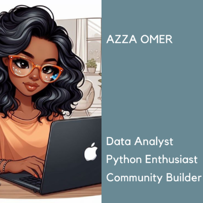

# Hi there, I'm Azza 😊

## Welcome to my GitHub profile!🙋‍♀️

**I'm a data scientist passionate about turning raw data into actionable insights,
optimizing workflows, and driving success. Skilled in data-driven problem-solving,
innovation, and knowledge sharing within the data community.**

---

### 🗃️Professional Experience

#### 🌟Freelance Data Analyst (2023 _ Present)

- Delivered tailored data analysis solutions for various clients, focusing on
business insights, forecasting, and process optimization.
- Developed interactive dashboards and reports using Power BI and
Excel to support decision-making.
- Built predictive models and visualizations to address customer needs
in diverse industries.

#### 🌟 Teaching Assistant _ University of Khartoum (2024)

- Guided students in linear regression, statistical analysis, and Python programming.
- Supported research activities, emphasizing data organization and
machine learning techniques.

#### 🌟 Data Engineer Intern _ STEM Sudan (2023)

- Designed and implemented meteorological stations using Arduino and NodeMCU
for environmental data collection.
- Conducted data analysis to provide insights into climate and environmental conditions.

---

### 💻Technical Skills

- Programming & Analytics: Python, R, SQL, SPSS
- Visualization & Tools: Power BI, Excel, Tableau
- Specialties: Machine Learning, Data Visualization, Statistics

---

### 📚Key Projects

- Construction Template System: Designed and automated an Excel-based template
system with integrated visualizations for a construction company, improving
efficiency in project and financial management.
- Arabic Sentiment Analysis: Built a machine learning model for analyzing
Arabic digital text sentiment using Python.
- Customer Retention Prediction: Developed predictive models to analyze and
reduce customer churn rates with machine learning.
- Food Point Mobile App: Designed and developed a mobile app for restaurant
management, focusing on user-friendly interfaces and seamless functionality.

---

### 📨📩Let's Connect

- LinkedIn: [linkedin.com/in/azza-omer](https://www.linkedin.com/in/azza-omer-389373173?utm_source=share&utm_campaign=share_via&utm_content=profile&utm_medium=android_app)
- Portfolio: [datascienceportfol.io/azza](https://www.datascienceportfol.io/azzamohamedadm)
- GitHub: [github.com/AzzaOmer1](https://github.com/AzzaOmer1)
- Gmail: [Gmail.com/AzzaOmer](mailto:azzads1111@gmail.com)

---

**🚀 Always excited to collaborate on data science and machine learning projects.
Let’s solve problems and innovate together!**
